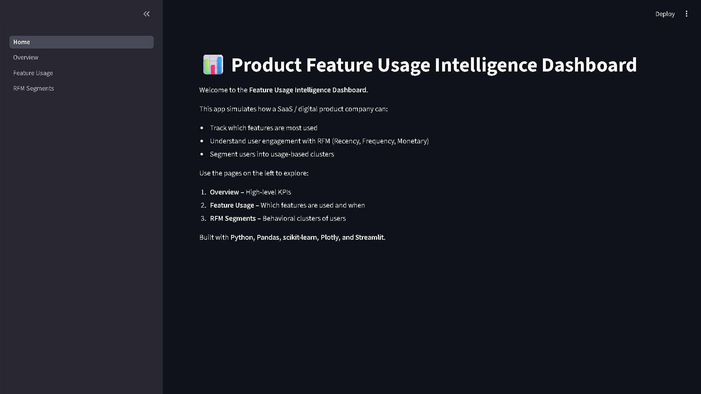
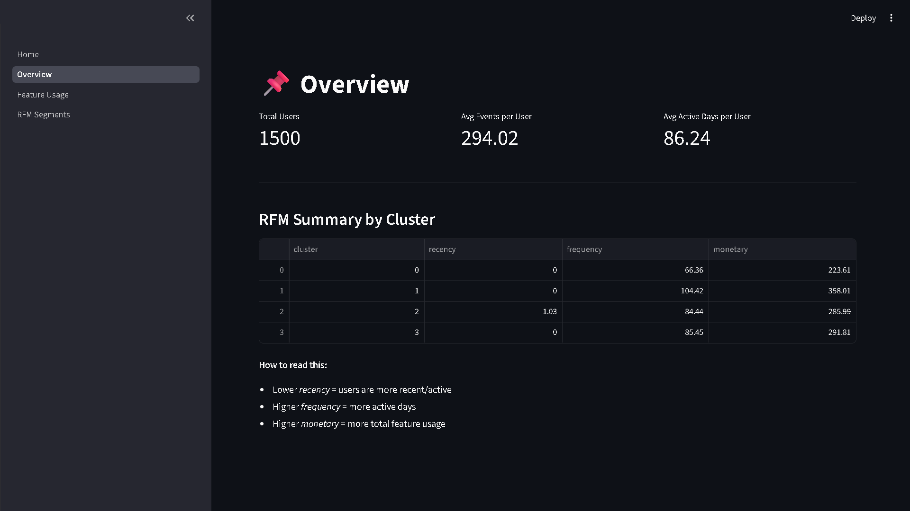
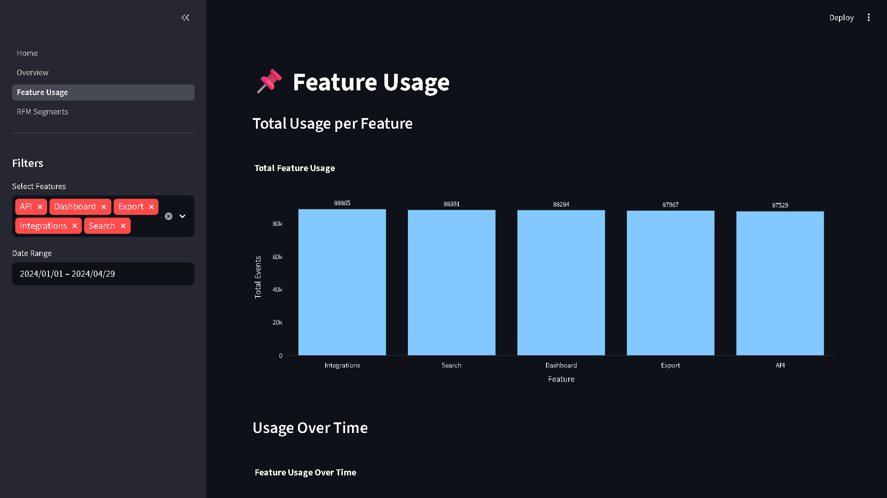
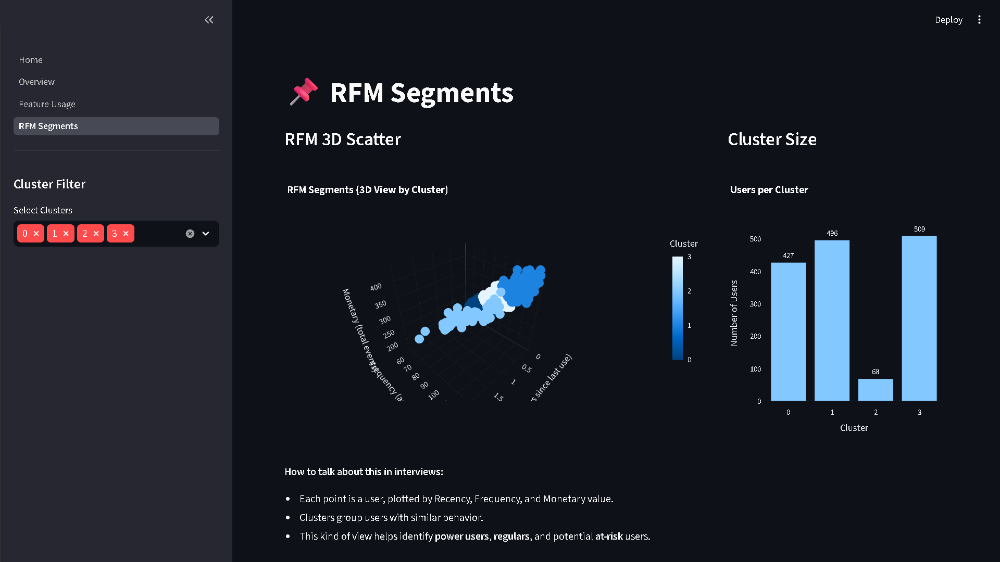

# 🌟 Intelligent Product Feature Usage Analytics with AI Insights

### AI-Powered Product Analytics • Feature Adoption Intelligence • User Engagement Analytics • Behavioral Segmentation

---

<div align="center">



<i>Product Intelligence Dashboard for Feature Adoption Analytics, User Engagement Monitoring & Product Decision Intelligence</i>

<br/>


<br/>

</div>

---

# 🖼️ Project Overview

This project simulates a real SaaS product analytics workflow where user interaction and feature adoption behavior are analyzed to generate actionable product intelligence insights.

The system helps analyze:
- feature adoption trends
- user engagement patterns
- behavioral segmentation
- product usage intelligence
- retention-oriented user behavior

The dashboard combines:
- feature usage analytics
- RFM-based behavioral scoring
- KMeans user segmentation
- product KPI monitoring
- interactive product intelligence dashboards

Built using:
- Streamlit
- Pandas & NumPy
- Plotly
- Scikit-learn
- KMeans Clustering

---

# 🚀 Key Business Capabilities

- Product feature adoption analysis
- User engagement monitoring
- Feature usage intelligence
- RFM behavioral analytics
- User segmentation workflows
- Product KPI monitoring
- Retention-focused analytics
- Interactive product dashboards

---

# ✨ Key Features

- End-to-end product analytics workflow
- Synthetic clickstream data generation
- Feature adoption intelligence
- RFM behavioral analysis
- KMeans user segmentation
- Interactive multi-page Streamlit dashboard
- Automated model evaluation
- Pytest-based testing
- Modular production-style architecture

---

# 💼 Business Problem

Modern digital products generate massive volumes of event-level user interaction data. However, organizations often struggle to:

- identify which features are actively used
- understand user engagement behavior
- improve feature adoption rates
- monitor active vs inactive users
- prioritize product roadmap decisions
- optimize product-led growth strategies

Without product intelligence systems, organizations may face:

- low feature adoption visibility
- weaker retention understanding
- inefficient product prioritization
- reduced user engagement
- poor behavioral analytics visibility

This project demonstrates how analytics-driven product intelligence can support:

- product growth optimization
- engagement-focused product strategies
- feature adoption improvement
- retention intelligence workflows

---

# 📈 Business Impact

This platform helps organizations analyze:

- feature adoption trends
- user engagement behavior
- retention-oriented user activity
- behavioral usage patterns
- active vs inactive user groups
- product usage intelligence

The platform demonstrates how product analytics workflows can improve:

- product decision-making
- feature prioritization
- engagement optimization
- user retention strategies
- product-led growth workflows

---

# 🧩 Multi-Page Product Intelligence Dashboard

| Module                     | Function                                  |
|----------------------------|-------------------------------------------|
| 🏠 Home Page               | Project overview & navigation             |
| 📊 Overview Dashboard      | Product KPIs & engagement metrics         |
| 📈 Feature Usage Analytics | Feature adoption & usage trends           |
| 🧮 RFM Segmentation        | Behavioral user segmentation & clustering |

---

# 📸 Platform Screenshots

## ⭐ Home Dashboard

<div align="center">
  
</div>

---

## ⭐ Product Intelligence Overview Dashboard

<div align="center">
  
</div>

---

## ⭐ Feature Adoption & Usage Analytics

<div align="center">
  
</div>

---

## ⭐ RFM Behavioral Segmentation Dashboard

<div align="center">
  
</div>

---

# 📊 Key Product Intelligence Insights

The analysis revealed several important product usage patterns:

## 🔹 Feature Adoption Trends

- Dashboard emerged as the most actively used feature.
- API & Integration features showed lower adoption rates.

## 🔹 Engagement Intelligence

Power users demonstrated:

- low recency
- high frequency
- strong engagement intensity

At-risk users showed:

- higher inactivity periods
- declining engagement frequency

## 🔹 Behavioral Segmentation

The KMeans model successfully separated users into:

- **Cluster 0 — Power Users**
- **Cluster 1 — Regular Users**
- **Cluster 2 — At-Risk Users**
- **Cluster 3 — Dormant Users**

These insights support:

- product roadmap planning
- re-engagement campaigns
- feature onboarding strategies
- retention-focused analytics

---

# 🧬 Product Intelligence Workflow

```text
Synthetic Product Usage Data
            ↓
Data Cleaning & Preprocessing
            ↓
RFM Feature Engineering
(Recency • Frequency • Monetary)
            ↓
KMeans User Segmentation
            ↓
Behavioral Product Intelligence
            ↓
Interactive Streamlit Dashboard
            ↓
Product & Growth Decision Intelligence
```

---

# 🧠 Tech Stack

| Category | Technologies |
|----------|--------------|
| Language | Python 3.10+ |
| Data Analysis | Pandas, NumPy |
| Machine Learning | Scikit-learn, KMeans |
| Visualization | Plotly |
| Dashboard/UI | Streamlit |
| Analytics | RFM Segmentation |
| Testing | PyTest |

---

# 📁 Project Structure

```text
Product-Feature-Usage-Intelligence/
│
├── app/
│   ├── Home.py
│   └── pages/
│       ├── 1_Overview.py
│       ├── 2_Feature_Usage.py
│       └── 3_RFM_Segments.py
│
├── data/
│   ├── raw/
│   └── processed/
│
├── models/
│   └── kmeans_rfm.pkl
│
├── scripts/
│   ├── generate_synthetic_data.py
│   ├── preprocess_data.py
│   ├── build_rfm.py
│   └── train_model.py
│
├── screenshots/
│   ├── home.png
│   ├── overview.png
│   ├── feature_usage.png
│   └── rfm_segments.png
│
├── src/
│   ├── evaluate_model.py
│   ├── __init__.py
│   ├── preprocessing.py
│   ├── rfm.py
│   └── viz.py
│
├── tests/
│   └── test_predict.py
│
├── .gitignore
├── README.md
└── requirements.txt
```

---

# ⚙️ Installation

## 1️⃣ Clone Repository

```bash
git clone https://github.com/girishshenoy16/Product-Feature-Usage-Intelligence.git
cd Product-Feature-Usage-Intelligence
```

---

## 2️⃣ Create Virtual Environment

```bash
python -m venv venv
```

### Activate Virtual Environment

#### Windows PowerShell

```powershell
.\venv\Scripts\Activate.ps1
```

#### Windows CMD

```cmd
venv\Scripts\activate
```

---

## 3️⃣ Install Dependencies

```bash
python.exe -m pip install --upgrade pip
pip install -r requirements.txt
```

---

# ▶️ Running the Project

## 1️⃣ Generate Synthetic Product Usage Data

```bash
python scripts/generate_synthetic_data.py
```

---

## 2️⃣ Preprocess & Build Features

```bash
python scripts/preprocess_data.py
python scripts/build_rfm.py
```

---

## 3️⃣ Train KMeans Segmentation Model

```bash
python scripts/train_model.py
```

---

## 4️⃣ Evaluate the Model

```bash
python src/evaluate_model.py
```

---

## 5️⃣ Run Tests

```bash
pytest
pytest -v
pytest -q
```

---

## 6️⃣ Launch Streamlit Dashboard

```bash
streamlit run app/Home.py
```

Your dashboard opens at:

👉 http://localhost:8501

---

# 🧰 Dashboard Walkthrough

## ✔ Overview Dashboard

Monitor:

- total users
- average events per user
- engagement KPIs
- RFM cluster summaries

---

## ✔ Feature Usage Analytics

Analyze:

- feature adoption trends
- time-series usage behavior
- feature-level engagement patterns

---

## ✔ RFM Segmentation Dashboard

Explore:

- behavioral user clusters
- engagement segmentation
- recency-frequency-monetary insights

---

# 📊 Model Evaluation

The KMeans segmentation model was evaluated using:

- Silhouette Score
- Inertia
- Cluster-level RFM analysis

The evaluation workflow helps validate:

- cluster quality
- user behavior separation
- segmentation consistency

---

# 🔮 Future Scope

- Churn prediction integration
- Cohort retention heatmaps
- Real-time usage ingestion pipelines
- Product funnel analytics
- Feature correlation intelligence
- User journey visualization
- Cloud deployment workflows
- Product experimentation analytics

---

# 🤝 Contribution

Contributions, suggestions, and improvements are welcome.

If you found this project valuable, consider starring the repository.

---

<div align="center">

### ⚡ Product Intelligence & Feature Adoption Analytics for Product-Led Growth

</div>